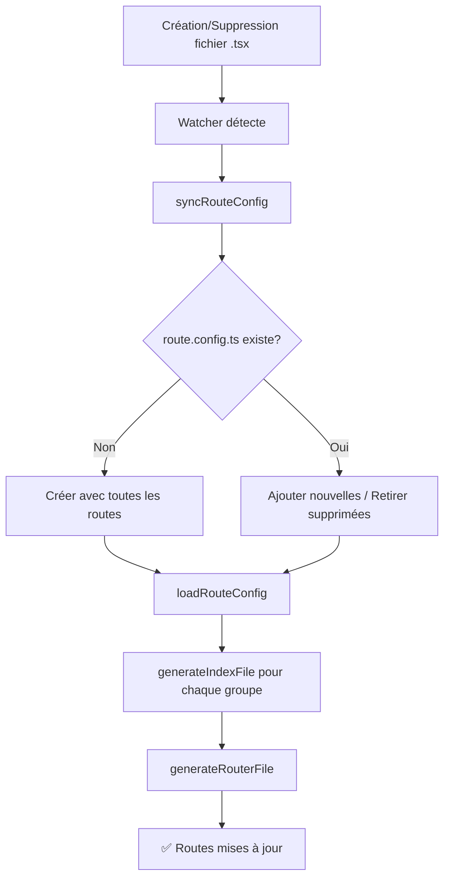

# 📚 Documentation : watch-routes.ts

## 📖 Vue d'ensemble

Le script `watch-routes.ts` est le cœur du système de routing hybride de l'application. Il combine les avantages du **code-based routing** (TanStack Router) avec la flexibilité de personnaliser les chemins d'URL sans modifier la structure de fichiers.

## 🎯 Objectifs

1. **Auto-génération** : Génère automatiquement les routes à partir de la structure de fichiers
2. **Personnalisation** : Permet de redéfinir les chemins d'URL via `route.config.ts`
3. **Hot Reload** : Détecte les changements de fichiers sans rechargement complet de la page
4. **Préservation** : Ne jamais écraser les configurations utilisateur

## 🏗️ Architecture

### Structure des dossiers surveillés

```
src/routes/
├── route.config.ts    ← Configuration centralisée (auto-générée mais préservée)
├── root.tsx           ← Route racine
├── public/            ← Routes publiques (basePath: "/")
│   ├── index.tsx      ← Auto-généré
│   └── home.tsx
├── auth/              ← Routes d'authentification (basePath: "/auth")
│   ├── index.tsx      ← Auto-généré
│   ├── login.tsx
│   └── register.tsx
└── protected/         ← Routes protégées (basePath: "/app")
    ├── index.tsx      ← Auto-généré
    ├── dashboard.tsx
    └── settings.tsx
```

## 🔧 Fonctionnement

### 1. Surveillance des fichiers

Le watcher utilise **chokidar** pour surveiller le dossier `src/routes/` :

```typescript
chokidar.watch(routesRoot, { ignoreInitial: true }).on("all", (event, filePath) => {
  if (filePath.includes("route.config.ts")) return // Ignore les changements de config
  if (!filePath.endsWith(".tsx")) return
  
  if (event === "add") {
    // Nouveau fichier détecté
    ensureComponentFile(filePath) // Initialise avec un template
    rebuildAll()
  } else if (event === "unlink") {
    // Fichier supprimé
    rebuildAll()
  }
})
```

### 2. Synchronisation de `route.config.ts`

La fonction `syncRouteConfig()` :

**Création initiale** (si le fichier n'existe pas) :
- Scanne tous les fichiers `.tsx` dans `routes/`
- Génère une entrée pour chaque route avec `override: false`
- Crée le fichier avec le header de documentation

**Mise à jour** (si le fichier existe) :
- Parse ligne par ligne sans regex complexe
- **Préserve** toutes les lignes de configuration existantes
- Ajoute uniquement les nouvelles routes (avec `🆕` dans le commentaire)
- Retire les routes dont le fichier a été supprimé

```typescript
// Exemple de ligne préservée :
"auth/login": { path: "/login", override: true }, // Personnalisé par l'utilisateur

// Exemple de ligne ajoutée automatiquement :
"public/about": { path: "about", override: false }, // 🆕 Auto-ajouté
```

### 3. Génération des `index.tsx`

Pour chaque groupe (`public/`, `auth/`, `protected/`), la fonction `generateIndexFile()` :

1. **Scanne** tous les fichiers `.tsx` du groupe
2. **Lit** la configuration depuis `route.config.ts` (via `loadRouteConfig()`)
3. **Génère** les routes en respectant les overrides :

```typescript
if (useOverride && config?.path !== undefined) {
  // Override activé : utilise le path personnalisé
  childPath = config.path
  isAbsolutePath = childPath.startsWith("/")
} else {
  // Fallback : utilise la structure de fichiers
  childPath = local === "" ? "/" : local
}
```

4. **Écrit** le fichier `index.tsx` avec les imports et exports

### 4. Génération de `router.ts`

La fonction `generateRouterFile()` :

1. Collecte toutes les routes de tous les groupes
2. Sépare les routes **absolues** (path commence par `/`) des **relatives**
3. Construit l'arbre de routes :

```typescript
export const routeTree = rootRoute.addChildren([
  publicRoute.addChildren([homeRoute]),     // Routes relatives au groupe
  authRoute.addChildren([registerRoute]),   
  protectedRoute.addChildren([...]),        
  loginRoute                                 // Route absolue (hors du groupe)
])
```

### 5. Initialisation des nouveaux composants

Quand un nouveau fichier `.tsx` est créé vide, `ensureComponentFile()` l'initialise :

```typescript
export default function NomDuComposant() {
  return <div>NomDuComposant</div>
}
```

## 📋 Flux de travail complet



## 🎨 Cas d'usage

### Cas 1 : Créer une nouvelle route

**Action** : Créer `src/routes/public/about.tsx`

**Résultat** :
1. Le fichier est initialisé avec un composant de base
2. `route.config.ts` est mis à jour :
   ```typescript
   "public/about": { path: "about", override: false }, // 🆕 Auto-ajouté
   ```
3. `public/index.tsx` génère `aboutRoute`
4. `router.ts` ajoute la route à l'arbre
5. URL accessible : `/about`

### Cas 2 : Redéfinir le chemin d'une route

**Action** : Modifier `route.config.ts`
```typescript
"auth/login": { path: "/login", override: true }, // Change path et active override
```

**Résultat** :
1. **Redémarrer le serveur** (Ctrl+C puis `npm run dev`)
2. `login.tsx` est maintenant accessible via `/login` (au lieu de `/auth/login`)
3. La route est attachée directement à `rootRoute` (pas `authRoute`)

### Cas 3 : Supprimer une route

**Action** : Supprimer `src/routes/public/about.tsx`

**Résultat** :
1. Le watcher détecte la suppression
2. `syncRouteConfig()` retire la ligne de `route.config.ts`
3. `public/index.tsx` ne génère plus `aboutRoute`
4. `router.ts` retire la route de l'arbre

## ⚙️ Configuration

### Groupes de routes

Définis dans `routeGroups` :

```typescript
const routeGroups: Record<string, string> = {
  public: "/",           // Routes publiques → basePath "/"
  auth: "/auth",         // Routes d'auth → basePath "/auth"
  protected: "/app",     // Routes protégées → basePath "/app"
}
```

Pour ajouter un nouveau groupe :
1. Ajouter une entrée dans `routeGroups`
2. Créer le dossier `src/routes/nouveau-groupe/`
3. Le watcher détectera automatiquement les routes

### Variables importantes

| Variable | Description |
|----------|-------------|
| `routesRoot` | Chemin absolu vers `src/routes/` |
| `routerFile` | Chemin absolu vers `src/router.ts` |
| `routeConfigFile` | Chemin absolu vers `src/routes/route.config.ts` |
| `routeConfig` | Config chargée dynamiquement depuis le fichier |

## 🔍 Fonctions principales

### `loadRouteConfig()`
Charge la configuration depuis `route.config.ts` en parsant le fichier texte.

### `syncRouteConfig()`
Synchronise `route.config.ts` avec la structure de fichiers (ajoute/retire des routes).

### `generateIndexFile(group, basePath)`
Génère le fichier `index.tsx` pour un groupe de routes.

### `generateRouterFile()`
Génère le fichier `router.ts` avec l'arbre complet des routes.

### `ensureComponentFile(filePath)`
Initialise un nouveau composant vide avec un template par défaut.

### `rebuildAll()`
Régénère tout : config + index de tous les groupes + router.

## 🚨 Points d'attention

### ⚠️ Les modifications de `route.config.ts` nécessitent un redémarrage

Le fichier est chargé **au démarrage** du serveur. Pour que les changements soient pris en compte :
1. Sauvegarder `route.config.ts`
2. Arrêter le serveur (Ctrl+C)
3. Relancer (`npm run dev`)

### ⚠️ Ne pas supprimer `route.config.ts`

Si le fichier est supprimé, il sera **recréé avec les valeurs par défaut** et **toutes les personnalisations seront perdues** !

### ⚠️ Routes absolues vs relatives

- **Path RELATIF** (`"login"`) : Ajouté au basePath du groupe
  - `"auth/login": { path: "login" }` → `/auth/login`

- **Path ABSOLU** (`"/login"`) : Ignore le basePath du groupe
  - `"auth/login": { path: "/login", override: true }` → `/login`

### ⚠️ La propriété `override` doit être `true`

Sans `override: true`, le path personnalisé est ignoré (sauf pour les paths absolus).

## 🧪 Debugging

### Logs générés

Le watcher affiche des logs pour chaque route :

```
📍 [auth] login.tsx → configKey="auth/login" → path="/login" 🔧 override (absolu)
📍 [protected] dashboard.tsx → configKey="protected/dashboard" → path="dashboard"
```

Légende :
- `🔧 override` : Route avec override activé
- `(absolu)` : Path absolu (commence par `/`)

### Vérifier la configuration chargée

La fonction `loadRouteConfig()` tente de parser `route.config.ts`. Si elle échoue, elle affiche un warning et utilise une config vide.

## 📦 Dépendances

- **chokidar** : Surveillance des fichiers
- **TanStack Router** : Routing React
- **fs** / **path** : Manipulation de fichiers Node.js

## 🔗 Fichiers liés

- [`route.config.md`](./route.config.md) : Documentation de `route.config.ts`
- [`router.md`](./router.md) : Documentation de `router.ts`
- [`ROUTING-GUIDE.md`](../ROUTING-GUIDE.md) : Guide utilisateur complet

## 💡 Améliorations futures

- [ ] Support des routes dynamiques (`$id.tsx`)
- [ ] Support des layouts imbriqués
- [ ] Hot reload de `route.config.ts` sans redémarrage
- [ ] Validation du schema TypeScript de `route.config.ts`
- [ ] CLI pour créer des routes (`npm run route:new -- public about`)
